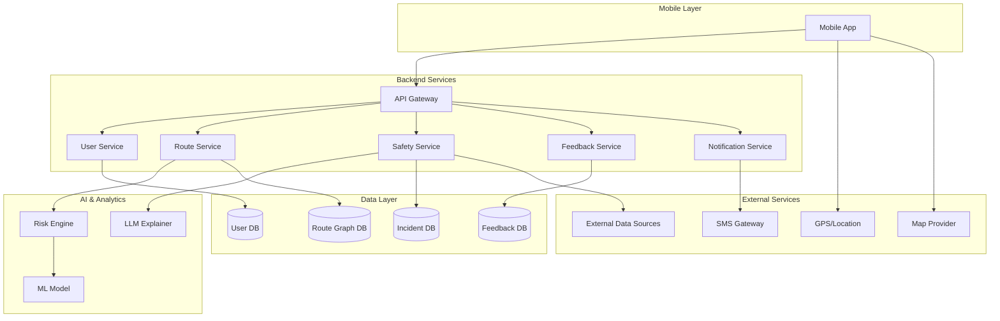

# Design Document: SafeRoute

## Overview

SafeRoute is a mobile-first public transport safety companion that empowers users (primarily women and vulnerable groups) to make informed travel decisions. The system combines real-time location tracking, historical incident data, crowdsourced feedback, and machine learning to generate safety scores for route segments. The architecture is designed for scalability from a single-city MVP to multi-city deployment.

The core value proposition is captured in the tagline: "Know your safe options, before you step out." Users receive safety-scored route alternatives before beginning their journey, with active monitoring and emergency features during travel.

## Architecture

### High-Level Architecture

The system follows a three-tier architecture:

1. **Mobile Application Layer**: Native mobile apps (iOS/Android) providing user interface, local caching, and offline capabilities
2. **Backend Services Layer**: Microservices handling API requests, business logic, and data orchestration
3. **Data & Analytics Layer**: Databases, ML models, and external data integrations



### Component Responsibilities

**Mobile Application**:
- User interface and interaction
- GPS location tracking
- Local data caching for offline mode
- Voice input/output handling
- Map rendering and visualization
- SOS trigger and emergency contact notification

**API Gateway**:
- Request routing and load balancing
- Authentication and authorization
- Rate limiting and throttling
- Request/response transformation

**User Service**:
- User registration and authentication
- Profile management
- Emergency contact management
- Preference storage

**Route Service**:
- Route calculation using routing engine (OSRM/GraphHopper)
- Multi-modal transport integration
- Route optimization with safety weighting
- ETA and cost estimation

**Safety Service**:
- Safety score calculation
- Incident data aggregation
- Help point management
- Real-time risk assessment

**Feedback Service**:
- User feedback collection
- Report validation and spam prevention
- Crowdsourced data aggregation
- Feedback integration into safety scores

**Notification Service**:
- SOS alert distribution
- Location sharing with emergency contacts
- Push notifications
- SMS fallback for critical alerts

**Risk Engine**:
- ML-based safety score calculation
- Feature engineering from multiple data sources
- Model training and updates
- Score normalization

**LLM Explainer**:
- Natural language generation for safety explanations
- Voice-friendly message formatting
- Context-aware reassurance messaging

### Data Flow

**Route Discovery Flow**:
1. User enters origin/destination (text or voice)
2. Mobile app sends request to API Gateway
3. Route Service queries routing engine for path options
4. Safety Service calculates scores for each route segment
5. Risk Engine applies ML model to generate final scores
6. Routes returned to user with safety visualization

**Safety Mode Flow**:
1. User starts trip, activating Safety Mode
2. Mobile app begins continuous location tracking
3. Location updates sent to backend every 10 seconds
4. Safety Service monitors for route deviations
5. If SOS triggered: Notification Service alerts emergency contacts
6. Location shared in real-time until trip completion

**Feedback Flow**:
1. User submits rating or report
2. Feedback Service validates and stores data
3. Aggregation job runs periodically (hourly)
4. Risk Engine retrains model with new data (daily)
5. Updated scores reflected in route calculations

## Components and Interfaces

### Mobile Application Modules

**Login & Profile Module**:
- Interface: `UserProfileManager`
- Methods:
  - `registerUser(phone: String, email: String): Result<User>`
  - `updatePreferences(userId: String, prefs: Preferences): Result<Unit>`
  - `addEmergencyContact(userId: String, contact: Contact): Result<Unit>`
  - `getProfile(userId: String): Result<UserProfile>`

**Route Search Module**:
- Interface: `RouteSearchManager`
- Methods:
  - `searchRoutes(origin: Location, destination: Location): Result<List<Route>>`
  - `searchRoutesVoice(audioInput: ByteArray): Result<List<Route>>`
  - `getRouteDetails(routeId: String): Result<RouteDetails>`

**Map & Visualization Module**:
- Interface: `MapRenderer`
- Methods:
  - `displayRoutes(routes: List<Route>): Unit`
  - `colorCodeSegment(segment: RouteSegment, score: SafetyScore): Unit`
  - `showHelpPoints(points: List<HelpPoint>): Unit`
  - `highlightSegment(segmentId: String): Unit`

**Voice Assistant Module**:
- Interface: `VoiceAssistant`
- Methods:
  - `startVoiceGuidance(route: Route): Unit`
  - `announceInstruction(instruction: String): Unit`
  - `alertLowSafetySegment(segment: RouteSegment): Unit`
  - `processVoiceCommand(audio: ByteArray): Result<Command>`

**Safety Mode & SOS Module**:
- Interface: `SafetyModeManager`
- Methods:
  - `activateSafetyMode(route: Route): Result<Unit>`
  - `deactivateSafetyMode(): Result<Unit>`
  - `triggerSOS(): Result<Unit>`
  - `shareLocation(contacts: List<Contact>): Result<Unit>`
  - `trackLocation(): Flow<Location>`

### Backend Service APIs

**User Service API**:
```
POST   /api/v1/users/register
POST   /api/v1/users/login
GET    /api/v1/users/{userId}/profile
PUT    /api/v1/users/{userId}/profile
POST   /api/v1/users/{userId}/emergency-contacts
GET    /api/v1/users/{userId}/emergency-contacts
```

**Route Service API**:
```
POST   /api/v1/routes/search
GET    /api/v1/routes/{routeId}
GET    /api/v1/routes/{routeId}/segments
POST   /api/v1/routes/voice-search
```

**Safety Service API**:
```
GET    /api/v1/safety/score?lat={lat}&lon={lon}
GET    /api/v1/safety/help-points?lat={lat}&lon={lon}&radius={radius}
GET    /api/v1/safety/incidents?area={area}&timeRange={range}
POST   /api/v1/safety/sos
```

**Feedback Service API**:
```
POST   /api/v1/feedback/rating
POST   /api/v1/feedback/report
GET    /api/v1/feedback/route/{routeId}
```

**Admin Dashboard API**:
```
GET    /api/v1/admin/heatmap?city={cityId}
GET    /api/v1/admin/incidents?city={cityId}&timeRange={range}
PUT    /api/v1/admin/help-points/{pointId}
GET    /api/v1/admin/analytics/trends
POST   /api/v1/admin/export
```

### Data Models

**User**:
```typescript
interface User {
  userId: string;
  phone?: string;
  email?: string;
  createdAt: timestamp;
  preferences: UserPreferences;
  emergencyContacts: Contact[];
}

interface UserPreferences {
  transportModes: TransportMode[];
  accessibilityNeeds: AccessibilityOptions;
  voiceSettings: VoiceSettings;
}

interface Contact {
  name: string;
  phone: string;
  relationship: string;
}
```

**Route**:
```typescript
interface Route {
  routeId: string;
  origin: Location;
  destination: Location;
  segments: RouteSegment[];
  overallSafetyScore: number;
  estimatedTime: number; // minutes
  estimatedCost: number;
  transportModes: TransportMode[];
}

interface RouteSegment {
  segmentId: string;
  startLocation: Location;
  endLocation: Location;
  transportMode: TransportMode;
  safetyScore: number;
  distance: number; // meters
  duration: number; // seconds
  geometry: GeoJSON;
}

interface Location {
  latitude: number;
  longitude: number;
  address?: string;
}
```

**Safety Data**:
```typescript
interface SafetyScore {
  score: number; // 0-100
  confidence: number; // 0-1
  factors: SafetyFactors;
  timestamp: timestamp;
}

interface SafetyFactors {
  incidentRate: number;
  lightingLevel: number;
  crowdDensity: number;
  timeFactor: number;
  helpPointProximity: number;
}

interface Incident {
  incidentId: string;
  location: Location;
  type: IncidentType;
  severity: number;
  timestamp: timestamp;
  source: string;
}

interface HelpPoint {
  pointId: string;
  location: Location;
  type: HelpPointType; // police_station, hospital, public_facility
  name: string;
  operatingHours: string;
  verified: boolean;
}
```

**Feedback**:
```typescript
interface Feedback {
  feedbackId: string;
  routeId?: string;
  location: Location;
  rating: number; // 1-5
  comment?: string;
  anonymous: boolean;
  timestamp: timestamp;
  userId?: string;
}

interface Report {
  reportId: string;
  location: Location;
  description: string;
  category: ReportCategory;
  anonymous: boolean;
  timestamp: timestamp;
  userId?: string;
  verified: boolean;
}
```

### Risk Scoring Model Design

The safety score calculation uses a weighted combination of multiple factors:

**Formula**:
```
RiskScore = w1 × IncidentRate 
          + w2 × LightingLevel 
          + w3 × CrowdDensity 
          + w4 × TimeFactor 
          + w5 × HelpPointProximity

SafetyScore = 100 × (1 - normalize(RiskScore))
```

**Feature Engineering**:
- **IncidentRate**: Historical incidents per km² in the past 90 days, normalized by city average
- **LightingLevel**: Time-based factor (0.0 for night without streetlights, 1.0 for daylight)
- **CrowdDensity**: Estimated pedestrian/vehicle density from transport schedules and historical patterns
- **TimeFactor**: Risk multiplier based on time of day (higher at night, lower during peak hours)
- **HelpPointProximity**: Distance to nearest help point, inverse normalized (closer = safer)

**Weights** (tunable via ML training):
- w1 = 0.35 (incident history is primary factor)
- w2 = 0.20 (lighting is significant)
- w3 = 0.15 (crowd density matters)
- w4 = 0.15 (time context)
- w5 = 0.15 (help point access)

**ML Model**:
- Algorithm: Gradient Boosted Trees (XGBoost)
- Training data: Historical routes with user ratings + incident data
- Features: All safety factors + derived features (day of week, weather, events)
- Target: User safety ratings (1-5) normalized to 0-1
- Retraining: Daily batch job with new feedback data

### Routing Engine Design

The system uses OSRM (Open Source Routing Machine) or GraphHopper as the base routing engine, with custom safety-based edge weighting:

**Modified Edge Weight**:
```
FinalWeight = Distance × SafetyMultiplier

SafetyMultiplier = 1 + (1 - SafetyScore/100) × SafetyPreference

where SafetyPreference ∈ [0, 2]
  0 = ignore safety (fastest route)
  1 = balanced (default)
  2 = maximum safety (may be longer)
```

**Multi-Modal Routing**:
- Graph includes nodes for bus stops, metro stations, walking paths
- Edges represent transport segments with mode-specific costs
- Transfer penalties applied at mode switches
- Accessibility constraints filter incompatible edges

**Route Ranking**:
Routes are ranked by composite score:
```
RouteScore = α × (1/TravelTime) + β × SafetyScore + γ × (1/Cost)

Default: α=0.4, β=0.4, γ=0.2
```

### Voice Assistant Design

**Speech-to-Text**:
- Use device native STT (iOS Speech Framework, Android SpeechRecognizer)
- Fallback to cloud STT for better accuracy (Google Cloud Speech-to-Text)
- Language models trained on local place names and transport terminology

**Text-to-Speech**:
- Use device native TTS for low latency
- Adjust speech rate and pitch for clarity
- Preload common phrases for instant playback

**LLM-Based Explanation Generator**:
The system uses an LLM to convert numeric safety scores into natural, reassuring language:

**Input to LLM**:
```json
{
  "safetyScore": 75,
  "factors": {
    "incidentRate": "low",
    "lighting": "good",
    "crowdDensity": "moderate",
    "helpPoints": "2 within 500m"
  },
  "context": "evening commute"
}
```

**LLM Prompt Template**:
```
You are a calm, reassuring safety assistant. Convert this safety data into a brief, 
non-threatening message for a user planning their route:

Safety Score: {safetyScore}/100
Key Factors: {factors}
Context: {context}

Guidelines:
- Be concise (1-2 sentences)
- Focus on positive aspects
- Mention nearby help if score is low
- Avoid alarming language
- Sound natural and conversational
```

**Example Output**:
"This route looks good for your evening commute. There's moderate foot traffic and two police stations nearby if you need them."

## Correctness Properties

*A property is a characteristic or behavior that should hold true across all valid executions of a system—essentially, a formal statement about what the system should do. Properties serve as the bridge between human-readable specifications and machine-verifiable correctness guarantees.*

